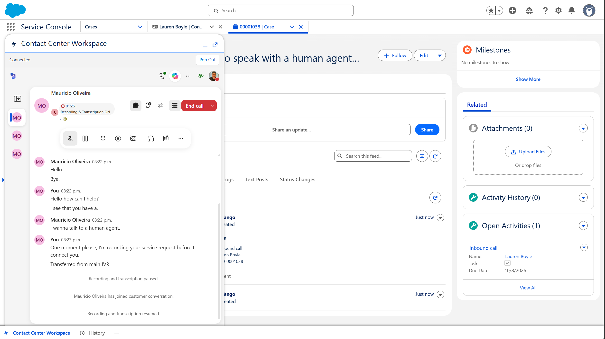
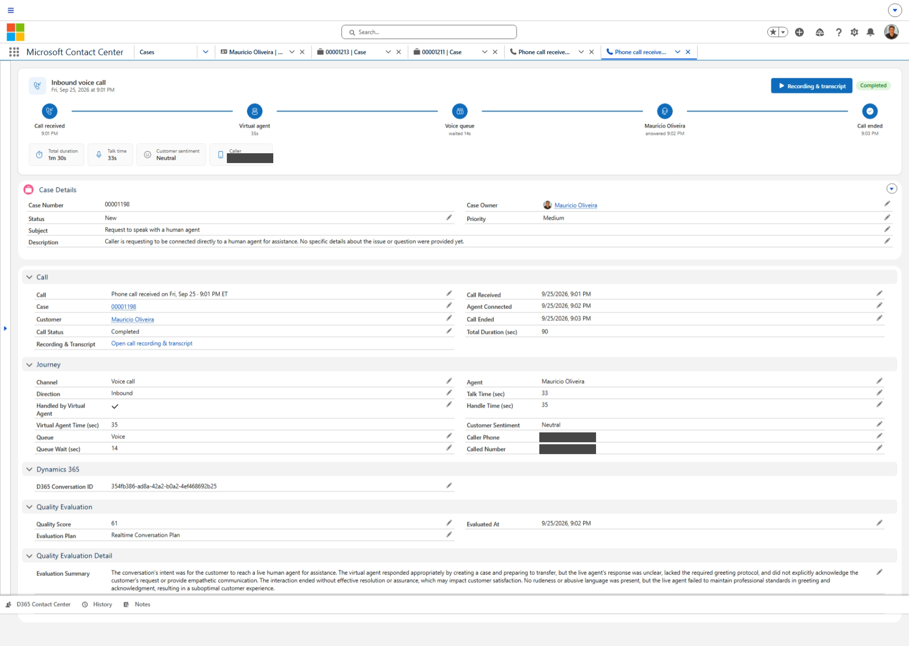
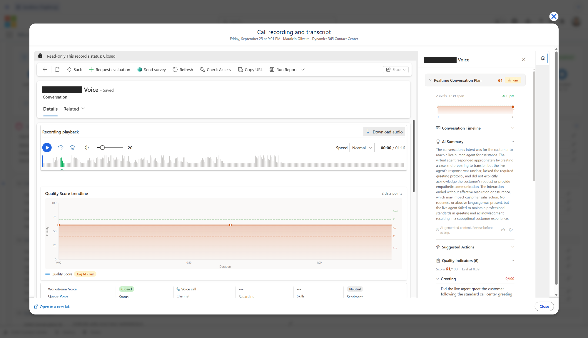
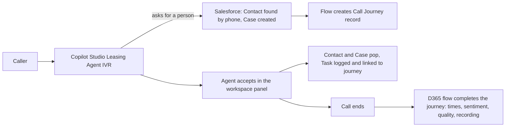

# Dynamics 365 Contact Center Workspace x Salesforce - with Call Journey

Run **Dynamics 365 Contact Center** inside the Salesforce Service Console using Microsoft's Contact Center Workspace package, and get a full **call journey** on the Case: IVR (Copilot Studio) > Case with the right Contact > agent accepts > Case and Contact pop > call logged and linked > recording, transcript and quality score after the call.

> **Community sample, not an official Microsoft or Salesforce product.** The Microsoft Contact Center Workspace package used here (`04tak000000aSFVAA2`) is a **pre-release** for Developer Edition, sandbox and scratch orgs. Do not install it in production. Try everything in a sandbox first.

## What the agent sees

When the agent accepts the call in the Contact Center Workspace panel, Salesforce **automatically opens the caller's Contact record and the Case that the IVR created over the phone**. The agent has everything ready before saying hello: who is calling, the case subject and description the virtual agent captured, and the call journey.



During and after the call, the Case shows the **Call Journey**: IVR > virtual agent > queue > agent > call ended, with times, sentiment, quality score and the recording.



**Recording & transcript** opens the Dynamics 365 player, transcript and quality evaluation without leaving Salesforce.



> The utility bar shows only the **Contact Center Workspace** and **History** items. The automation that makes the pop-ups work runs as a utility item with a blank name and no icon, so it takes no visible space.


## What you get

| Piece | Where | What it does |
|---|---|---|
| Contact Center Workspace package | Salesforce (Microsoft) | The agent panel (voice, chat, presence, Copilot) in the Service Console utility bar |
| Companion metadata | Salesforce | Automation bridge: matches the caller to a Contact, logs a call Task, pops the Contact and the Case, links the Task to the journey |
| Call Journey package | Salesforce | `Contact_Center_Call__c` journey record and timeline, Case recording link, settings |
| Dynamics 365 solution | Dynamics 365 | Flow that completes the journey after each call, Call Review app, recording pop-up fix; installed by one script |
| Leasing Agent | Copilot Studio | Voice IVR that finds the Contact by phone and creates the Case |

## Install in 4 steps

| Step | Where | Guide |
|---|---|---|
| 1 | Salesforce | [Install the Salesforce pieces](docs/1-install-salesforce.md) |
| 2 | Dynamics 365 | [Install the Dynamics 365 solution](docs/2-install-dynamics365.md) (one script) |
| 3 | Copilot Studio | [Import and connect the Leasing Agent](docs/3-configure-copilot-studio.md) (or [use your own agent](docs/your-own-agent.md)) |
| 4 | Test | [Test call and troubleshooting](docs/4-test-and-troubleshoot.md) |

**Prerequisites:** a Salesforce Developer Edition, sandbox or scratch org with the Service Console and System Administrator access; a Dynamics 365 Contact Center environment with a working voice channel and workstream; Copilot Studio in the same environment; the Salesforce CLI (`sf`) is recommended.

## Repository contents

```
salesforce/
  call-journey/   D365ContactCenter_CallJourney_Salesforce.zip (+ source)   48 components
  companion/      source for the bridge, quick actions, permission set, Task link, trusted URLs
dynamics365/      D365ContactCenterSalesforceCallJourney_1_1_1_0.zip (+ web resource source)
                  Install-D365Solution.ps1 (one command: import, connections, flow on, form fix, app roles, Salesforce setting)
                  Apply-ConversationFormFix.ps1 (form fix + CSP check, also run by the install script)
copilot-studio/   LeasingAgentSalesforce_1_0_0_0.zip (+ unpacked source and topic YAML)
docs/             step-by-step guides and screenshots
```

## Let an AI assistant install it for you

Copy the whole prompt into an AI assistant that can run commands and/or use a browser (for example **GitHub Copilot CLI**, **Claude Code** or Claude with computer use). It asks a few questions, installs in the right order, checks each step and ends with a test call. It cannot sign in for you; you sign in yourself, including MFA. If it cannot operate a browser it switches to a guided mode and walks you through each click.

> **Nothing to edit.** Paste it as is. Values in `<angle brackets>` or examples such as `contoso.crm.dynamics.com` are filled in by the assistant from your answers.
>
> If this repository is private, the assistant must clone it with your credentials (`gh repo clone`); the raw links work without that only when the repository is public.

````text
You are an installation engineer. Install the community solution "Dynamics 365 Contact Center Workspace x Salesforce, with Call Journey" for me, end to end, carefully and safely. Parts, IN ORDER: Salesforce, Dynamics 365, Copilot Studio.

SOURCE
Repository: https://github.com/moliveirapinto/d365-contact-center-workspace-salesforce
README (source of truth): https://raw.githubusercontent.com/moliveirapinto/d365-contact-center-workspace-salesforce/main/README.md
Step guides in the same repository (main branch): docs/1-install-salesforce.md, docs/2-install-dynamics365.md, docs/3-configure-copilot-studio.md, docs/4-test-and-troubleshoot.md, docs/your-own-agent.md.
Files (do NOT unzip the zips):
  A) Salesforce call journey package: salesforce/call-journey/D365ContactCenter_CallJourney_Salesforce.zip  (24,567 bytes)
  B) Salesforce companion source folder: salesforce/companion/ (deploy as source from force-app)
  C) Dynamics 365 solution: dynamics365/D365ContactCenterSalesforceCallJourney_1_1_1_0.zip  (13,614 bytes)
  D) Copilot Studio solution: copilot-studio/LeasingAgentSalesforce_1_0_0_0.zip  (31,760 bytes)
  E) Copilot Studio topic: copilot-studio/source/d365-context-variables-topic.yaml
  F) Dynamics 365 install script: dynamics365/Install-D365Solution.ps1 (it calls dynamics365/Apply-ConversationFormFix.ps1 in the same folder)
Easiest is to clone the repository (git clone, or gh repo clone moliveirapinto/d365-contact-center-workspace-salesforce if it is private) and work from the clone. Read the README and the step guides first. If they and this prompt disagree, follow the repository and tell me.

HOW TO WORK
- Use the tools you have (shell, Salesforce CLI "sf", browser, file download). If you cannot operate a browser, switch to GUIDE MODE: ONE step at a time with exact click paths, wait for me to say "done", and verify what I report before moving on.
- Never guess. If a screen, value or count differs from this prompt, STOP and tell me exactly what you see.
- Retry a failed action at most twice, then stop and show me the exact error.
- The automation bridge (component ccSalesforceBridge) must stay a NORMAL utility item of the Service Console utility bar (blank label and no icon are fine, as shipped). Never move it to the utility bar background components, never wrap it in a background Aura component, and never remove it: it does not run there, so no call Task is logged and the Contact and Case do not pop up when the agent accepts a call.
- Only do what is listed here. Do not delete or change any other record, field, flow, topic, form, utility bar or solution. Never touch a Salesforce org, Power Platform environment or Copilot Studio agent other than the ones I name.
- Sign-in: I sign in myself, including MFA. Tell me when you need it, then wait. Never ask me to paste passwords or tokens, never store any.
- Anything that can affect LIVE calls (publishing the Copilot Studio agent, turning on the sync flow in a production environment, replacing a utility bar, deploying to production) needs my explicit "yes" first. Say what will change.
- After each phase give one or two lines of status (OK / WARNING / FAILED) before continuing.

PHASE 0 - QUESTIONS (ask all in ONE message, then wait)
1. Salesforce: Developer Edition, sandbox, or scratch org? Which org (alias or login URL) and admin username? The Microsoft package is a pre-release and is not meant for production: if it is production, warn me and continue only after I answer an explicit "yes, production".
2. Dynamics 365: the Contact Center environment URL (for example https://contoso.crm.dynamics.com) and its name in Power Apps. Does it have a working voice channel and a voice workstream?
3. Time zone for call titles, as three values: standard-time offset from UTC in hours (for example -5), daylight saving rule (US, EU, or blank) and a short label (for example ET). Common: US Eastern -5/US/ET; Central -6/US/CT; Mountain -7/US/MT; Pacific -8/US/PT; Brazil -3/blank/BRT; UK 0/EU/GMT; Central Europe 1/EU/CET; India 5.5/blank/IST; Sydney 10/blank/AEST.
4. Salesforce users who need the permission sets "Contact Center Demo" and "D365 Contact Center Call Access": (a) every agent, (b) the Salesforce user the Copilot Studio agent uses to create Cases, (c) the Salesforce user for the Power Automate connection. Usernames please.
5. Copilot Studio: install the ready-made "Leasing Agent" from this repo, or update an existing agent (name?) following docs/your-own-agent.md? Is that agent used by LIVE callers right now?
6. Which Dataverse security roles do the agents have? The Contact Center Call Review app will be shared with them.
7. Does the org already have a hand-made Contact Center utility item (unmanaged d365EdgeContainer) or a customised Service Console utility bar? If yes, I must approve replacing it (you back it up first).
8. Confirm I can sign in to: Salesforce as System Administrator; Power Apps as System Administrator or System Customizer in the Contact Center environment; Copilot Studio as maker.

PHASE 1 - PREFLIGHT
1. Verify the file sizes of A, C and D (a different size is fine only if the README names newer files). A must be a valid zip whose first entry is package.xml; C contains solution.xml, customizations.xml, Workflows/*.json and a WebResources/ file; D contains solution.xml, customizations.xml and bots/.
2. Salesforce (after I sign in): sf org login web --alias <alias> (add --instance-url https://test.salesforce.com for a sandbox). Check whether the package is already installed (sf package installed list) and whether the object Contact_Center_Call__c and the field Case.D365_Conversation_Id__c exist (use the Tooling API: sf data query --use-tooling-api -q "SELECT DeveloperName FROM CustomField WHERE EntityDefinition.QualifiedApiName='Case' AND DeveloperName LIKE 'D365%'"). If they exist, an earlier version may be installed: STOP and ask whether to upgrade over it.
3. Power Apps (after sign-in, right environment): confirm the table Conversation (msdyn_ocliveworkitem) exists, else STOP. Check whether the solutions D365ContactCenterSalesforceCallJourney and LeasingAgentSalesforce already exist; if so tell me their versions and ask before importing over them.

PHASE 2 - SALESFORCE (docs/1-install-salesforce.md)
1. If an unmanaged d365EdgeContainer utility item exists (question 7), back up the utility bar (sf project retrieve start -m FlexiPage:LightningService_UtilityBar), then remove that item. After my "yes".
2. Install Microsoft's package: sf package install --package 04tak000000aSFVAA2 -o <alias> --wait 20 --publish-wait 5 --security-type AdminsOnly --no-prompt. Verify D365ContactCenter is listed in sf package installed list.
3. Call journey package: validate with sf project deploy start --metadata-dir <A> --single-package -o <alias> --dry-run --wait 10, expect Succeeded, 48 components, 0 errors; then run it again without --dry-run.
4. Companion: replace the placeholder YOUR-ORG in salesforce/companion/force-app/main/default/flexipages/*.flexipage-meta.xml with the host of my Dynamics 365 URL (without .crm.dynamics.com), then run in salesforce/companion: sf project deploy start -o <alias> --source-dir force-app --wait 20. Expect Succeeded. Tell me before you deploy: this replaces the Service Console utility bar (LightningService_UtilityBar).
5. Assign permission sets Contact_Center_Demo and D365_Contact_Center_Call_Access to every user from question 4 (sf org assign permset --name <name> --on-behalf-of <username> -o <alias>). Verify with SELECT Assignee.Username, PermissionSet.Name FROM PermissionSetAssignment WHERE PermissionSet.Name IN ('Contact_Center_Demo','D365_Contact_Center_Call_Access').
6. Verify: objects Contact_Center_Call__c and D365_Contact_Center_Settings__c; Case fields D365_Conversation_Id__c and D365_Call_Recording__c (Tooling API); flow D365CC_Create_Call_From_Case ACTIVE (FlowDefinition ActiveVersionId not empty); Task field Call_Journey__c; Contact fields Phone_Last10__c and Mobile_Last10__c; Trusted URLs D365_CC_Workspace_Portal, D365_CC_Microsoft_Login and D365_Contact_Center are active (SELECT DeveloperName, IsActive, EndpointUrl FROM CspTrustedSite).
7. Custom setting (Anonymous Apex, my real values, omit blank lines):
   D365_Contact_Center_Settings__c s = D365_Contact_Center_Settings__c.getOrgDefaults();
   s.Org_Url__c = 'https://contoso.crm.dynamics.com'; s.Time_Zone_Offset__c = -5; s.Daylight_Saving_Rule__c = 'US'; s.Time_Zone_Label__c = 'ET'; upsert s;
   Leave App_Id__c empty; Phase 3 fills it. Verify one org-level row.

PHASE 3 - DYNAMICS 365 (docs/2-install-dynamics365.md). ALL SCRIPTED: do not click through make.powerapps.com.
1. Prerequisites: PowerShell 7 (pwsh) and the Azure CLI. Sign in with "az login" (I sign in myself, MFA included) using an account that is System Administrator or System Customizer in the Contact Center environment. If az reports several subscriptions, remember the one that holds the environment and pass -Subscription "<name>".
2. PREVIEW (changes nothing): pwsh -File dynamics365/Install-D365Solution.ps1 -OrgUrl <D365 URL> -SalesforceAlias <alias> -ShareWithRoles "<role 1>","<role 2>" -TimeZoneOffset <n> -DaylightSavingRule <US|EU|none> -TimeZoneLabel <label> -WhatIf
   (use my answers from question 3 and 6; leave out options I did not give; add -Subscription if needed). Show me the output.
3. If the preview stops with exit code 2 because there is NO Connected Salesforce connection (this is the only step that needs me, it is a one-time OAuth sign-in): give me the link the script prints (https://make.powerapps.com/environments/<id>/connections), tell me to click New connection > Salesforce > Production (or Sandbox to match) > Create and sign in to the SAME Salesforce org as Phase 2 (a connection to another org leaves calls stuck In progress), then wait for me to say "done" and run the preview again. If the script lists several Salesforce connections, ask me which one and pass it with -SalesforceConnection "<name or id>".
4. After my "yes" (ask first if production), run the same command WITHOUT -WhatIf. It imports the solution (skips when 1.1.1.0 or newer is already there), binds both connection references, turns the sync flow on, applies the Conversation form fix (library new_d365cc_evaluationpanefix.js + On load handler D365CC.EvaluationPaneFix.onLoad), grants the roles access to the Contact Center Call Review app and publishes it, and writes Org_Url__c, App_Id__c and the time zone into the Salesforce custom setting. Safe to run again.
5. Verify read-only: the solution D365ContactCenterSalesforceCallJourney is installed at 1.1.1.0; the cloud flow "D365 Contact Center - Sync ended calls to Salesforce" is On; SELECT Org_Url__c, App_Id__c, Time_Zone_Offset__c, Daylight_Saving_Rule__c, Time_Zone_Label__c FROM D365_Contact_Center_Settings__c shows exactly one row with my values and the App_Id__c from the script output.
6. The script also prints whether content security policy is enforced. If it is NOT enforced, nothing more to do. If it IS enforced, frame-ancestors must include https://*.lightning.force.com and https://*.my.salesforce.com (and my My Domain host); that one setting can only be changed in the Power Platform admin center (environment > Settings > Privacy + Security > Content security policy > App (model-driven) > Configure directives), so show me the current list and the values to add, guide me click by click, and ask before changing it.
7. If a script step fails, show me the exact error and, if it concerns the form or app, offer the manual steps in docs/2-install-dynamics365.md as a fallback.
PHASE 4 - COPILOT STUDIO (docs/3-configure-copilot-studio.md)
A) Ready-made agent (question 5): Solutions > Import solution > file D, in the SAME environment, with a Salesforce connection for the Phase 2 org. Open the agent "Leasing Agent" in https://copilotstudio.microsoft.com > Topics > Escalate and select my Salesforce connection on both Salesforce actions (Get records, Create record). Confirm topic "D365 Context Variables" exists and Global.msdyn_ConversationId has "External sources can set values" ON. Ask for my explicit "yes, publish" if live callers use it, then publish.
   Then, in Dynamics 365 Customer Service admin center > Workstreams > my Voice workstream > bot/agent setting, select Leasing Agent (guide me click by click if you cannot do it). This changes live call handling: ask first.
B) Existing agent: follow docs/your-own-agent.md exactly (conversation id topic with file E, Contact lookup by Phone_Last10__c / Mobile_Last10__c, Case with ContactId, AccountId and D365_Conversation_Id__c). If the agent creates NO Case, STOP and ask me. Publish only after my "yes".

PHASE 5 - END-TO-END TEST (docs/4-test-and-troubleshoot.md)
Ask me to: hard-refresh Salesforce (Ctrl+Shift+R), open the Service Console, sign in to the Contact Center panel (pop-up, MFA is mine) and set presence Available. Then call my Contact Center number from a phone number saved on a Salesforce Contact (Phone or Mobile), ask the IVR for a person, accept, talk briefly and end the call. Check, read-only:
- A new Case with the Contact attached and D365_Conversation_Id__c filled: SELECT CaseNumber, ContactId, D365_Conversation_Id__c FROM Case ORDER BY CreatedDate DESC LIMIT 5
- A Contact_Center_Call__c linked to the Case: SELECT Id, Name, Status__c, Case__c FROM Contact_Center_Call__c ORDER BY CreatedDate DESC LIMIT 5
- On accept, the Contact and then the Case open in the console, and a Task "Inbound call" exists related to the Case with Call_Journey__c set.
- One to two minutes after the call ends, the journey status is Completed with queue, agent, talk/wait time and sentiment.
- The Recording & transcript button opens the pop-up with player, transcript and evaluation pane.
If I cannot place a call, offer the Salesforce-only smoke test from docs/4-test-and-troubleshoot.md (needs my explicit yes; creates and then deletes two labelled test records).
If something is missing, use docs/4-test-and-troubleshoot.md. In particular, a journey stuck on In progress means the flow's Salesforce connection points at another org: open the flow run, look at the Update_Salesforce_call action, and report it.

STOP AND ASK ME WHENEVER
- a check, count or screen differs from this prompt,
- you are asked to sign in, approve MFA, accept terms or pay for anything,
- the target is production and I have not said "yes, production",
- the next action could affect live calls or replace the utility bar and I have not said yes,
- you would have to do something that is not in this prompt.

FINAL REPORT
A table with every phase and its result, then: (1) anything I still have to do by hand, (2) which Salesforce users hold the permission sets and which user the sync flow connection uses, (3) what you changed and how to roll back (the utility bar backup, the docs/4 "Uninstall" section), (4) a reminder that this is a community sample, not an official Microsoft or Salesforce product, that the Microsoft package is a pre-release for dev/sandbox orgs, and that a sandbox test comes first.

START with PHASE 0.
````

## What the prompt cannot do

- Sign in or approve MFA for you, including the one-time Salesforce sign-in that creates the Salesforce connection used by the sync flow (the only manual step in Step 2).
- Create a Contact Center voice channel, phone number or workstream, or give your user a Contact Center license.
- Bind the Leasing Agent to the voice workstream in every tenant without your help; that is done in the Customer Service admin center.

## Good to know

- No Open CTI: this workspace has no softphone or click-to-dial in Salesforce. Outbound calls use the workspace dialer.
- Callers are matched to a Contact by **Phone or Mobile** (last 10 digits). D365 itself only uses Mobile/Account phone for its own matching.
- Salesforce caches pages aggressively: hard-refresh (Ctrl+Shift+R) after deploying.
- The recording pop-up needs the Conversation form fix (applied by the script `dynamics365/Apply-ConversationFormFix.ps1`) and, only if your environment enforces content security policy, the `frame-ancestors` entries. See [Step 2](docs/2-install-dynamics365.md).

## Troubleshooting and uninstall

See [docs/4-test-and-troubleshoot.md](docs/4-test-and-troubleshoot.md).

## License

MIT, see [LICENSE](LICENSE). Provided as is, without warranty. Microsoft, Dynamics 365, Copilot Studio, Salesforce and other names are trademarks of their owners.
